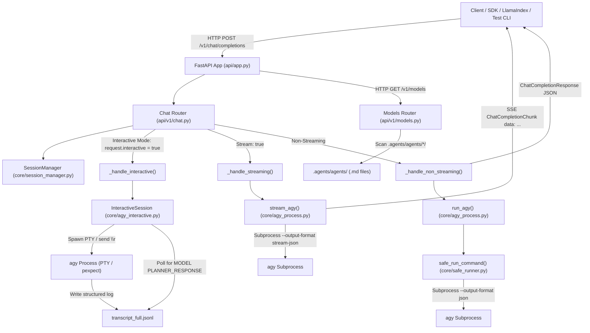

# AGENTS.md — Agent & Developer Context Guide for `hebras-ai`

Welcome to **hebras-ai**. This document provides essential architectural context, operational patterns, codebase layout, configuration options, and development guidelines for AI coding agents and human contributors working within this repository.

---

## 1. Project Overview

`hebras-ai` is an **OpenAI-compatible REST API server** built on top of [FastAPI](https://fastapi.tiangolo.com/) that acts as an adapter layer over Google Antigravity (`agy` CLI binary).

### Key Purposes:
- **Standardized Interface**: Exposes OpenAI-compatible endpoints (`/v1/chat/completions` and `/v1/models`) so external clients, LLM orchestration frameworks (e.g. LlamaIndex, LangChain, OpenAI Python SDK), and web frontends can seamlessly interface with local `agy` agents.
- **Direct 1:1 Natural Agent Naming**: Models are exposed directly by their natural agent names (e.g. `default`, `code_reviewer`, `planner`). Interactive or non-streaming/streaming execution modes are runtime behaviors, not model name prefixes.
- **Three Execution Modes**:
  1. **Non-Streaming**: Direct CLI execution with `--output-format json`.
  2. **Streaming (SSE)**: Real-time chunked streaming via `--output-format stream-json` yielding Server-Sent Events (SSE).
  3. **Interactive (PTY)**: Persistent background pseudoterminal process managed via `pexpect`, delivering prompts via carriage return (`\r`) and synchronizing responses deterministically from structured transcript logs (`transcript_full.jsonl`).
- **Dynamic Agent Discovery**: Automatically scans `.agents/agents/` to expose local agent profiles as OpenAI models directly by their directory name.
- **Session & Concurrency Management**: In-memory session tracking with turn counts, idle timeouts, background cleanup, and concurrency locks.

---

## 2. System Architecture & Request Flows



### Execution Modes Detailed

| Mode | Trigger Condition | Execution Mechanism | Response Source |
| :--- | :--- | :--- | :--- |
| **Non-Streaming** | `stream=false, interactive=false` | Executes `safe_run_command()` with `agy --print <prompt> --agent <agent> --output-format json` | Parsed JSON stdout (`{"response": "...", "usage": ...}`) |
| **Streaming** | `stream=true, interactive=false` | Executes `stream_agy()` with `agy --output-format stream-json` | Real-time SSE chunks from `step_update.text_delta` |
| **Interactive** | `interactive=true` | Spawns long-lived `pexpect` PTY process with `TERM=dumb`, sends `\r` to submit prompt | Deterministic polling on `~/.gemini/antigravity-cli/brain/<conversation_id>/.system_generated/logs/transcript_full.jsonl` |

---

## 3. Directory Structure & File Map

```
hebras-ai/
├── AGENTS.md                      # This agent context and development guide
├── README.md                      # Project documentation
├── pyproject.toml                 # Dependencies, tool configs (pytest, ruff, setuptools)
├── requirements.txt               # Requirements export
├── docker-compose.yml             # Docker deployment configuration
│
├── api/                           # API Layer (FastAPI)
│   ├── __init__.py
│   ├── app.py                     # App factory (`create_app`), CORS, lifespan management
│   ├── deps.py                    # FastAPI dependencies (SessionManager injection)
│   ├── main.py                    # ASGI app instance for uvicorn (`uvicorn api.main:app`)
│   └── v1/
│       ├── __init__.py
│       ├── chat.py                # POST /v1/chat/completions endpoint
│       └── models.py              # GET /v1/models dynamic agent discovery
│
├── app/                           # CLI entry points
│   ├── __init__.py
│   └── main.py                    # Runnable module (`python -m app.main`)
│
├── core/                          # Core Orchestration Engine
│   ├── __init__.py
│   ├── agy_interactive.py         # InteractiveSession: persistent PTY via pexpect & transcript sync
│   ├── agy_process.py             # Subprocess execution: `run_agy` (JSON) and `stream_agy` (NDJSON)
│   ├── ansi_utils.py              # ANSI stripping and TUI chrome/spinner/banner extraction
│   ├── config.py                  # Settings (BaseSettings) reading dev.env / HEBRAS_* env vars
│   ├── logging_config.py          # Structured JSON log formatter
│   ├── safe_runner.py             # Process isolation, timeouts, and stdin protection (DEVNULL)
│   ├── session.py                 # AgySession dataclass (turn count, timestamps, model IDs)
│   ├── session_manager.py         # SessionManager pool: concurrency lock, max limit, auto-expiry
│   └── types.py                   # Pydantic models for OpenAI request/response/streaming formats
│
├── integrations/                  # Framework Integrations
│   ├── __init__.py
│   └── hebras_llm.py              # LlamaIndex CustomLLM & FunctionCallingLLM implementation
│
├── schemas/                       # Shared JSON schemas
│   ├── __init__.py
│   └── init_session_schema.py     # JSON Schema specification for session initialization
│
├── scripts/                       # Developer & Test Tools
│   └── test_cli.py                # Interactive CLI tool to test chat, stream, schema, multi-turn
│
├── .agents/                       # Project-level custom agents
│   ├── __init__.py
│   └── agents/                    # User custom agent definitions (<name>/<name>.md)
│       └── .gitkeep
│
└── tests/                         # Pytest Suite
    ├── __init__.py
    ├── conftest.py                # Async HTTP client and SessionManager fixtures
    ├── integration/
    │   ├── __init__.py
    │   ├── test_chat_endpoint.py  # Tests for /v1/chat/completions (sync, stream, multi-turn)
    │   └── test_models_endpoint.py# Tests for /v1/models agent discovery
    └── unit/
        ├── __init__.py
        ├── test_agy_interactive.py# Unit tests for InteractiveSession & transcript sync
        ├── test_agy_process.py    # Unit tests for run_agy and stream_agy
        ├── test_ansi_utils.py     # Unit tests for ANSI stripping & chrome extraction
        ├── test_llama_index_extended.py
        ├── test_llama_index_integration.py
        ├── test_safe_runner.py    # Unit tests for safe_run_command & timeout enforcement
        ├── test_session.py        # Unit tests for AgySession lifecycle
        ├── test_session_manager.py# Unit tests for SessionManager pool & eviction
        ├── test_session_manager_concurrency.py # Concurrent session creation/deletion tests
        └── test_types.py          # Unit tests for Pydantic type conversions & aliases
```

---

## 4. Agent Discovery & Model Naming

Agents are defined as Markdown files within `.agents/agents/<agent_name>/<agent_name>.md`.

### Agent Configuration Format
```markdown
---
name: my_agent
description: Brief description of the agent
tools:
  - read_file(*)
commandExecutionPolicy: off
---
You are my custom agent prompt instructions...
```

### Model Naming Rules:
- **Direct 1:1 Agent Names**: Model IDs match the agent's natural name (e.g. `default`, `code_reviewer`, `planner`).
- **Interactive Mode**: Triggered by `"interactive": true` in the JSON request body, preserving the same model ID.
- When `GET /v1/models` is called, it returns a list of all detected agents as `ModelInfo` objects with IDs matching `<agent_name>`, or the configured default agent (`default`) if no custom agents exist.

---

## 5. Configuration & Environment Variables

Settings are managed in `core/config.py` using `pydantic-settings`. They can be loaded from `dev.env` or from environment variables prefixed with `HEBRAS_`.

| Variable | Type | Default | Description |
| :--- | :--- | :--- | :--- |
| `HEBRAS_HOST` | `str` | `"127.0.0.1"` | Host to bind the API server |
| `HEBRAS_PORT` | `int` | `8000` | Port to bind the API server |
| `HEBRAS_AGY_BINARY` | `str` | `"agy"` | Path or name of the agy CLI binary |
| `HEBRAS_AGY_DEFAULT_AGENT` | `str` | `"default"` | Default agent if unspecified |
| `HEBRAS_AGY_DEFAULT_MODEL` | `str` | `"Gemini 3.6 Flash (High)"` | Default underlying model passed to agy |
| `HEBRAS_AGY_DEFAULT_TIMEOUT` | `int` | `120` | Execution timeout (seconds) for non-streaming commands |
| `HEBRAS_AGY_DEFAULT_WORKSPACE` | `str` | `"."` | Default workspace directory passed via `--add-dir` |
| `HEBRAS_AGY_AGENTS_DIR` | `str` | `".agents/agents"` | Directory scanned for custom agent configs |
| `HEBRAS_AGY_DEFAULT_MODE` | `str \| None` | `None` | Default agy mode (`plan`, `accept-edits`, etc.) |
| `HEBRAS_AGY_DANGEROUSLY_SKIP_PERMISSIONS` | `bool` | `False` | Auto-approve tool execution in agy |
| `HEBRAS_AGY_INTERACTIVE_TIMEOUT` | `int` | `180` | Interactive session response timeout (seconds) |
| `HEBRAS_AGY_LOG_DIR` | `str` | `"log"` | Directory where PTY dump and session logs are written |
| `HEBRAS_MAX_SESSIONS` | `int` | `10` | Maximum active concurrent sessions in the pool |
| `HEBRAS_SESSION_IDLE_TIMEOUT` | `int` | `600` | Session idle expiration threshold (seconds) |
| `HEBRAS_LOG_LEVEL` | `str` | `"INFO"` | Logging level (`DEBUG`, `INFO`, `WARNING`, `ERROR`) |
| `HEBRAS_LOG_FORMAT` | `str` | `"json"` | Log format (`"json"` or `"text"`) |

---

## 6. Development Workflows & Commands

### 1. Environment Setup
The project uses Python 3.12+ and `uv` / standard virtual environments:
```bash
# Activate existing virtual environment
source .venv/bin/activate
```

### 2. Running the API Server
```bash
# Using uvicorn with hot reload
uvicorn api.main:app --reload --port 8000

# Or using the app entry point
python -m app.main
```

### 3. Running Automated Tests
```bash
# Run entire test suite
pytest

# Run unit tests only
pytest tests/unit

# Run integration tests only
pytest tests/integration

# Run with verbose output
pytest -v
```

### 4. Code Quality & Linting
```bash
# Lint with ruff
ruff check .

# Format code with ruff
ruff format .
```

### 5. Interactive Test CLI
An interactive terminal CLI is available for manually testing endpoints:
```bash
# Ensure server is running on port 8000/8080 first
python scripts/test_cli.py
```

Commands available in `test_cli.py`:
- `agents`: List discovered agents (`GET /v1/models`).
- `agent <name>`: Switch active agent.
- `chat <prompt>`: Send non-streaming chat completion.
- `stream <prompt>`: Send streaming chat completion via SSE.
- `schema <prompt>`: Send completion with JSON Schema enforcement.
- `multi`: Start an interactive multi-turn conversation.

### 6. LlamaIndex Integration Example
```bash
python integrations/hebras_llm.py
```

---

## 7. Guidelines & Rules for AI Agents

When implementing changes or adding features to this codebase, you MUST adhere to the following rules:

### Rule 1: Include Error Handling, Logging, and Tests
- **Error Handling**: Raise explicit, domain-specific exceptions (e.g. `AgyProcessError`, `InteractiveSessionError`, `SessionNotFound`, `SessionPoolFull`). Never silently suppress errors.
- **Logging**: Use standard `logging.getLogger(__name__)`. Provide contextual information using the `extra={...}` dictionary (e.g. `extra={"session_id": ..., "agent": ..., "duration_ms": ...}`).
- **Tests**: Every new feature, endpoint change, or utility function MUST be accompanied by corresponding unit or integration tests under `tests/unit/` or `tests/integration/`. Always verify that all tests pass (`pytest`) before concluding your task.

### Rule 2: Non-Interactive Subprocess Safety
- Subprocesses must never block indefinitely waiting for user input. Always use `safe_run_command()` with `DEVNULL` stdin protection or ensure `pexpect` drain loops are in place.
- Enforce explicit execution timeouts on all subprocesses.

### Rule 3: Async & Concurrency Safety
- `SessionManager` state is protected by `asyncio.Lock()`. Ensure all operations modifying session dictionaries or interacting with shared state acquire the lock.
- Never perform blocking synchronous I/O operations directly inside async route handlers.

### Rule 4: Pydantic v2 Compatibility
- All data models in `core/types.py` use Pydantic v2. Use `model_dump_json()`, `model_dump()`, and `model_config = {"populate_by_name": True}`.

### Rule 5: Keep Documentation Synchronized
- If you add new configuration variables, update `core/config.py` and document them in `AGENTS.md`.
- If you add new agents or routes, update the architecture section and file maps accordingly.
