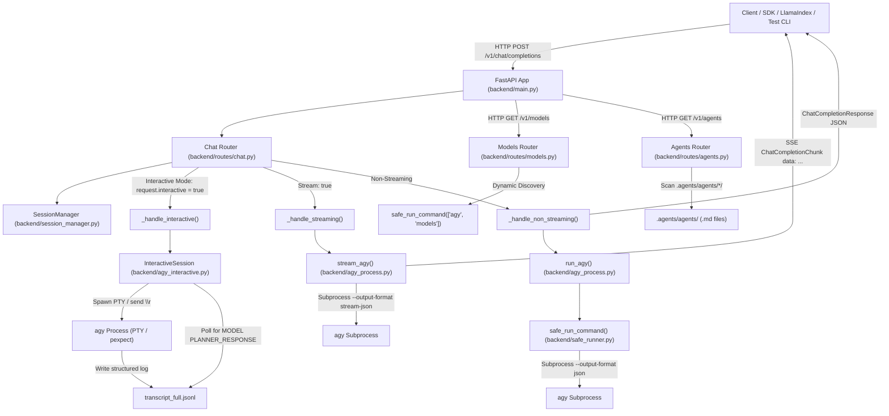

# AGENTS.md — Agent & Developer Context Guide for `hebras-ai`

Welcome to **hebras-ai**. This document provides essential architectural context, operational patterns, codebase layout, configuration options, and development guidelines for AI coding agents and human contributors working within this repository.

---

## 1. Project Overview

`hebras-ai` is an **OpenAI-compatible REST API backend** built on top of [FastAPI](https://fastapi.tiangolo.com/) that acts as an adapter layer over Google Antigravity (`agy` CLI binary).

### Key Purposes & Separation of Concerns:
- **Clean Separation of "Agents" vs "Models"**:
  - **Agents** (`GET /v1/agents`): Persona, workflow instructions, and tool configurations discovered from `.agents/agents/<name>/<name>.md` or built-in (`default`). Passed to agy via `--agent <agent>`.
  - **Models** (`GET /v1/models`): Foundational LLM engines discovered dynamically via `agy models` (e.g. `Gemini 3.7 Flash`, `Gemini 3.6 Flash`, `Gemini 3.1 Pro`, `Claude Sonnet 4.6`, `Claude Opus 4.6`, `GPT-OSS 120B`) with reflection level parentheticals cleaned up.
- **Reflection / Reasoning Effort Control**:
  - `POST /v1/chat/completions` accepts `model` and `reflection` (or `reasoning_effort`: `low`, `medium`, `high`), dynamically mapping to the corresponding `agy` target (default: `Gemini 3.7 Flash (High)`).
- **OpenAI-Compatible Chat Completions**: Endpoint `/v1/chat/completions` accepting `messages`, `model` (LLM model), `agent` (agent persona), `reflection` / `reasoning_effort`, `stream`, `response_format` (JSON Schema), and `interactive`.
- **Three Execution Modes**:
  1. **Non-Streaming**: Direct CLI execution with `--output-format json`.
  2. **Streaming (SSE)**: Real-time chunked streaming via `--output-format stream-json` yielding Server-Sent Events (SSE).
  3. **Interactive (PTY)**: Persistent background pseudoterminal process managed via `pexpect`, delivering prompts via carriage return (`\r`) and synchronizing responses deterministically from structured transcript logs (`transcript_full.jsonl`).
- **Session & Concurrency Management**: In-memory session tracking with turn counts, idle timeouts, background cleanup, and concurrency locks.

---

## 2. System Architecture & Request Flows



---

## 3. Directory Structure & File Map

```
hebras-ai/
├── AGENTS.md                      # This agent context and development guide
├── README.md                      # Project documentation
├── pyproject.toml                 # Dependencies, tool configs (pytest, ruff, setuptools)
├── requirements.txt               # Requirements export
├── docker-compose.yml             # Docker deployment configuration
│
├── backend/                       # Backend Application Package
│   ├── __init__.py
│   ├── main.py                    # App factory (`create_app`), lifespan, CORS, entry point
│   ├── config.py                  # Settings (BaseSettings) reading dev.env / HEBRAS_* env vars
│   ├── types.py                   # Pydantic models for OpenAI request/response/streaming formats
│   ├── session.py                 # AgySession dataclass (turn count, timestamps, agent & model IDs)
│   ├── session_manager.py         # SessionManager pool: concurrency lock, max limit, auto-expiry
│   ├── safe_runner.py             # Process isolation, timeouts, and stdin protection (DEVNULL)
│   ├── agy_process.py             # Subprocess execution: `run_agy` (JSON) and `stream_agy` (NDJSON)
│   ├── agy_interactive.py         # InteractiveSession: persistent PTY via pexpect & transcript sync
│   ├── ansi_utils.py              # ANSI stripping and TUI chrome/spinner/banner extraction
│   ├── logging_config.py          # Structured JSON log formatter
│   └── routes/                    # API Route Definitions
│       ├── __init__.py
│       ├── chat.py                # POST /v1/chat/completions endpoint
│       ├── models.py              # GET /v1/models dynamic model discovery & reflection resolver
│       └── agents.py              # GET /v1/agents dynamic agent persona discovery
│
├── integrations/                  # Framework Integrations
│   ├── __init__.py
│   └── hebras_llm.py              # LlamaIndex CustomLLM & FunctionCallingLLM implementation
│
├── scripts/                       # Developer & Test Tools
│   └── test_cli.py                # Interactive CLI tool to test chat, stream, schema, multi-turn
│
├── .agents/                       # Custom Agent Configurations
│   ├── __init__.py
│   └── agents/                    # User custom agent definitions (<name>/<name>.md)
│       └── .gitkeep
│
└── tests/                         # Pytest Suite
    ├── __init__.py
    ├── conftest.py                # Async HTTP client and SessionManager fixtures
    ├── integration/
    │   ├── __init__.py
    │   ├── test_agents_endpoint.py# Tests for /v1/agents agent persona discovery
    │   ├── test_chat_endpoint.py  # Tests for /v1/chat/completions (sync, stream, reflection)
    │   └── test_models_endpoint.py# Tests for /v1/models dynamic clean model discovery
    └── unit/
        ├── __init__.py
        ├── test_agy_interactive.py# Unit tests for InteractiveSession & transcript sync
        ├── test_agy_process.py    # Unit tests for run_agy and stream_agy
        ├── test_ansi_utils.py     # Unit tests for ANSI stripping & chrome extraction
        ├── test_llama_index_extended.py
        ├── test_llama_index_integration.py
        ├── test_safe_runner.py    # Unit tests for safe_run_command & timeout enforcement
        ├── test_session.py        # Unit tests for AgySession lifecycle
        ├── test_session_manager.py# Unit tests for SessionManager pool & eviction
        ├── test_session_manager_concurrency.py # Concurrent session creation/deletion tests
        └── test_types.py          # Unit tests for Pydantic type conversions & aliases
```

---

## 4. Configuration & Defaults

Settings are managed in `backend/config.py` using `pydantic-settings`.

| Variable | Type | Default | Description |
| :--- | :--- | :--- | :--- |
| `HEBRAS_HOST` | `str` | `"127.0.0.1"` | Host to bind the API server |
| `HEBRAS_PORT` | `int` | `8000` | Port to bind the API server |
| `HEBRAS_AGY_BINARY` | `str` | `"agy"` | Path or name of the agy CLI binary |
| `HEBRAS_AGY_DEFAULT_AGENT` | `str` | `"default"` | Default agent persona if unspecified |
| `HEBRAS_AGY_DEFAULT_MODEL` | `str` | `"Gemini 3.7 Flash"` | Default clean model name |
| `HEBRAS_AGY_DEFAULT_REFLECTION` | `str` | `"high"` | Default reflection level (`high`, `medium`, `low`) |
| `HEBRAS_MODEL_CACHE_TTL` | `int` | `300` | In-memory cache TTL for discovered models (seconds) |

---

## 5. Development Workflows & Commands

### 1. Running Automated Tests
```bash
pytest -v
```

### 2. Interactive Test CLI
```bash
python scripts/test_cli.py
```

Commands available in `test_cli.py`:
- `agents`: List discovered agent personas (`GET /v1/agents`).
- `agent <name>`: Switch active agent persona.
- `models`: List discovered clean LLM models (`GET /v1/models`).
- `model <name>`: Switch active clean LLM model.
- `level <low|medium|high>`: Switch reflection level.
- `chat <prompt>`: Send non-streaming chat completion.
- `stream <prompt>`: Send streaming chat completion via SSE.
- `schema <prompt>`: Send completion with JSON Schema enforcement.
- `multi`: Start an interactive multi-turn conversation.
